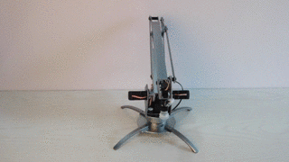
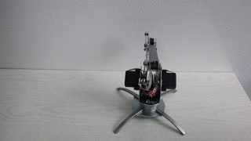
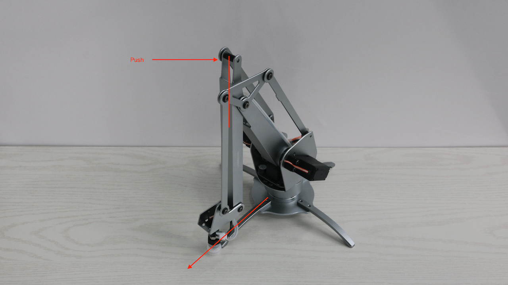
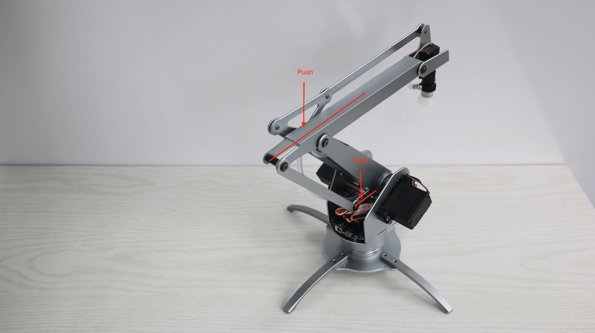

** 注意 **
在使用这些命令行工具之前，请安装 [uArm CLI](cli_installation.md)

# 如何安装?

## Windows


## uarm-listport

显示所有已连接的 uArm 接口

例如：
```
    $ uarm-listport
    /dev/cu.usbserial-AI04I17F
    /dev/cu.usbserial-A6031WSQ
    2 ports found
```


## uarm-firmware

uarm-firmware 可以帮助你升级你的 uArm 固件

<script type="text/javascript" src="https://asciinema.org/a/afvxol4gfoa9y8f1qgjort0ty.js" id="asciicast-afvxol4gfoa9y8f1qgjort0ty" async></script>

你可以使用 `uarm-firmware -h` 列出所有的指令帮助：

```
usage: uarm-firmware [-h] [-d] [-f [FORCE]] [-c [CHECK]] [-p [PORT]] [-u]

optional arguments:
  -h, --help            show this help message and exit
  -d, --download        download firmware into firmware.hex
  -f [FORCE], --force [FORCE]
                        without firmware path, flash default firmware.hex,
                        with firmware path, flash the firmware, eg. -f
                        Blink.ino.hex
  -c [CHECK], --check [CHECK]
                        remote - lateset firmware release version, local -
                        read uArm firmware version
  -p [PORT], --port [PORT]
                        provide port number
  -u, --upgrade         Upgrade firmware if remote version newer than local
                        version
```

- uarm-firmware -d

    自动下载最新的固件，你也可以根据以下地址自己下载  
     [http://download.ufactory.cc/firmware.hex](http://download.ufactory.cc/firmware.hex)

    你可以使用以地址获取最新的版本号  
     [http://download.ufactory.cc/version](http://download.ufactory.cc/version)

例如：
```
    uarm-firmware -d
    [1] - /dev/cu.usbserial-A6031WSQ
    [2] - /dev/cu.usbserial-AI04I17F
    Please Choose the uArm Port: 2
    Downloading firmware.hex...
    Downloading: 100% [#########################################] Time: 0:00:01  50.41 kB/s
```

- uarm-firmware -f

    默认情况下，如果你机械臂的固件版本是最新的，程序并不会更新你的固件，这个时候你可以使用 `-f` 或者 `--force` 参数  
    格式: -f 固件的路径  
    如果没有提供固件的路径，会使用默认 `firmware.hex`  

    例如：
        ```
        uarm-firmware -f
        ```  

- uarm-firmware -u

在你使用`-u` 或 `--upgrade` 参数时, 程序会对比当前 uArm 的版本和远程的最新版本, 如果有可更新的最新版本，会自动更新到这个版本  

- uarm-firmware -p

    如果只有一个 uArm 连接的情况下，程序会自动定位到这个端口，多个端口的时候需要你进行选择。  
    如果你需要自己指定端口，你可以使用 `-p` 或`--port` 参数, 如果你不知道端口号你可以先使用 `uarm-listport` 先列出有哪些可用的端口。  

    例子：
        `uarm-firmware -p /dev/cu.usbserial-AI04I17F`  
        你可以用别的参数绑定使用   
        `uarm-firmware -u -p /dev/cu.usbserial-AI04I17F`  

## uarm-calibrate

   **注意：如果你是2016年4月26号之后购买的 uArm，不需要进行校正，因为在出厂的时候，我们已经做过了校正，多次校正可能对 uArm 的精度造成影响**

   如果你是4月26号之前购买的，或者你仍然需要校正的，请认真的阅读以下的教程，使用不当，可能会对 uArm 造成损坏

### 准备工作  

#### 确保固件已经更新到最新版本

确保你的固件已经更新到最新的版本，你可以使用以下指令检查 `uarm-firmware -c remote`

#### 活动范围

  **注意: 当开始校正的时候，uArm 会自动的走向某些位置，有先位置可能是在桌子下的，所以请确保 uArm 的活动在一个安全范围内**

<center></center>
<center>pic1. 错误的固定方式</center>

<center></center>
<center>pic2. 正确的固定方式</center>


**进行校正时，uArm 的运动范围如下：**

<center>  </center>
<center>pic3. 活动范围 侧视</center>

<center>  </center>
<center>pic4.活动范围 俯视</center>

### 开始校正

准备工具做好后，我们可以开始校正

你也可以参照这个视频
<script type="text/javascript" src="https://asciinema.org/a/8rh8w7r44rh0x4vptx3naunkm.js" id="asciicast-8rh8w7r44rh0x4vptx3naunkm" async></script>

- 打开终端, 输入 `uarm-calibrate` 并回车
- 程序会自动检测你的校正状态，如果 uArm 已经校正过了，它会再一次提醒你是否需要校正， 如果是请输入『Y』继续：
```
    uarm-calibrate
    [1] - /dev/cu.usbserial-AI04I17F
    [2] - /dev/cu.usbserial-A6031WSQ
    Please Choose the uArm Port: 1
    Initialize uArm, port is /dev/cu.usbserial-AI04I17F...
    Firmware Version: 1.7.3
    uArm has been calibrated already, Are you sure want to Calibrate it again?
    Press Y if you want to calibrate anyway...
```
- 当校正开始以后，uArm 会自动的对每一个电机进行校正，这个过程我们称之为**线性度校正**
```
Press Y if you want to calibrate anyway...
Y
0. Clearing Completed Flag in EEPROM.
1.0. Clearing Linear Completed Flag in EEPROM.
1. Start Calibrate Linear Offset
    1.1. 0 Linear Offset - Servo 0
Servo Number: 0, Angle: 30, Analog: 170
Servo Number: 0, Angle: 31, Analog: 170
......
1.1. 1 Linear Offset - Servo 1
Servo Number: 1, Angle: 35, Analog: 193
Servo Number: 1, Angle: 36, Analog: 184
......
1.1. 2 Linear Offset - Servo 2
Servo Number: 2, Angle: 15, Analog: 123
Servo Number: 2, Angle: 16, Analog: 122
1.1. 3 Linear Offset - Servo 3
Servo Number: 3, Angle: 20, Analog: 125
Servo Number: 3, Angle: 21, Analog: 123
...
```
-  当线性度校正完成后，你会听到 uArm 发出 "beep beep beep" 的声音，并且在控制台中会打印以下信息：

```
Servo Number: 3, Angle: 159, Analog: 418
    1.2 Saving Servo Offset into EEPROM
Intercept Address:70, Offset Value:-22.0.
Slope Address:50, Offset Value:0.32.
Intercept Address:74, Offset Value:-19.27.
Slope Address:54, Offset Value:0.31.
Intercept Address:78, Offset Value:-22.84.
Slope Address:58, Offset Value:0.32.
Intercept Address:82, Offset Value:-35.06.
Slope Address:62, Offset Value:0.46.
    1.3 Mark Completed Flag in EEPROM
2.0. Clearing Servo Completed Flag in EEPROM.
2. Start Calibrate Servo Offset
Please move uArm in right position
Please move uArm to correct position, When complete, please press Enter to contine.
```

- 这个时候，你需要移动 uArm 到一个具体位置，进行**手动校正**

    - 电机 0: 45 度  
    - 电机 1: 130 度  
    - 电机 2: 20 度  

<center></center>
<center>pic5. 移动 uArm 到指定位置，正面图</center>

<center></center>
<center>pic6. 移动 uArm 到指定位置，背面图</center>

<center></center>
<center>pic7. 步骤1 移动电机0到45度位置</center>

<center></center>
<center>pic8. 步骤2 根据箭头指示对 uArm 施加力</center>

- 完成移动后，请回到控制台下，输入回车，它会打印当前的电机误差值（这个值的大小不会影响 uArm 的性能，只是会减少有效活动范围）  
```
Please move uArm to correct position, When complete, please press Enter to contine.
servo offset, bottom: 1.12, left: -0.49, right: -11.86, hand: 1.35,
Confirm Please Press Y, Retry press Other Key:
```
- 当你输入Y确认以后，程序会把校正的数值保存在 uArm 储存空间里面。
```
Confirm Please Press Y, Retry press Other Key: y
    2.1 Saving Servo Offset into EEPROM
    2.3 Mark Completed Flag in EEPROM
3.0. Clearing Stretch Completed Flag in EEPROM.
    3.1 Saving Stretch Offset into EEPROM
    3.2 Mark Completed Flag in EEPROM
Calibration DONE!!
```
- 到此所有的步骤都完成了，恭喜！

## uarm-miniterm

miniterm 是一个迷你的uArm控制台，你可以在上面很简单的实现控制，只需要简单的几行命令。

<script type="text/javascript" src="https://asciinema.org/a/auywv7m5df1ma2nkuzqblgflq.js" id="asciicast-auywv7m5df1ma2nkuzqblgflq" async></script>

在命令行中输入 `uarm-miniterm` ，接下来就能看到这些信息（具体的样式可能跟操作系统有差异）

```
$ uarm-miniterm
Welcome to use uArm Command Line - v0.1.3
Shortcut:
Quit: Ctrl + D, or input: quit
Clear Screen: Ctrl + L

Input help for more usage
```

你可以随时按`Ctrl + D` 或者输入`quit`退出，建议你先输入`help`，看一下有哪些命令可以使用。
```
>>> help
uArm Command line Help Center

Please use connect before any control action
Shortcut:
Quit: Ctrl + D, or input: quit
Clear Screen: Ctrl + L

Documented commands (type help <topic>):
----------------------------------------
EOF    connect     firmware   gripper  mv    quit        servo
alarm  disconnect  get_coord  move_to  pump  read_angle  write_angle

Miscellaneous help topics:
--------------------------
msg

Undocumented commands:
----------------------
debug  help  set_polar
```
如果你对某一个命令感兴趣的，例如，move_to，那我们输入帮助指令：`help move_to`

```
>>> help move_to

        move_to, move to destination coordinate.
        format: move_to X Y Z or move_to X Y Z S
        X,Y,Z unit centimeter, S time - default 2 sec
        eg. move_to 12 -12 12
```
基本上所有的控制指令都需要你先连接uArm，如果你没有连接uArm并使用了控制指令，你会收到以下的提示。
```
>>> mv
No uArm is connected, please use connect
```
输入`connect`会自动连接uArm，如果你的电脑有两台以上的uArm连接，会让你选择连接哪个
```
>>> connect
Initialize uArm, port is /dev/cu.usbserial-AI04I17F...
Firmware Version: 1.7.3
```
