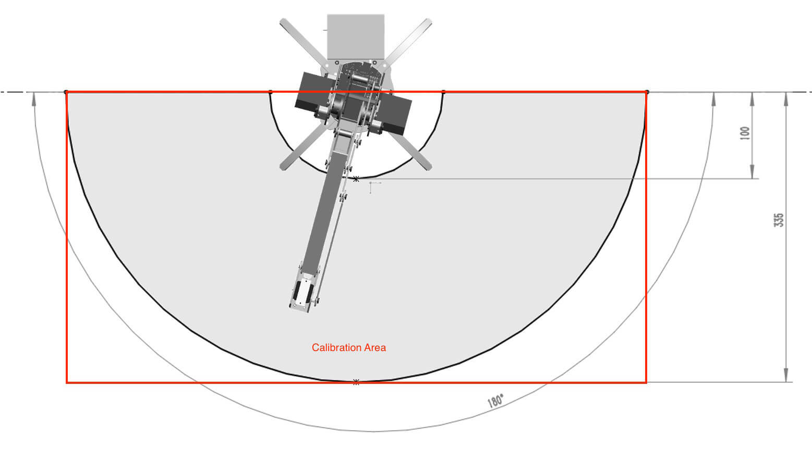

# uArm CommandLine User Guide

** Notice **
Please make sure you install the uArm cli before. please refer [uArm CLI](cli_installation.md)

# How to run cli?

## Windows


## uarm-listport

list all connected uArm ports.

eg.
```
    $ uarm-listport
    /dev/cu.usbserial-AI04I17F
    /dev/cu.usbserial-A6031WSQ
    2 ports found
```


## uarm-firmware

firmware helper could help you upgrade your uArm Firmware to latest version.

You could use `uarm-firmware -h` to list all the usage:

```
usage: uarm-firmware [-h] [-d] [-f [FORCE]] [-c [CHECK]] [-p [PORT]] [-u]

optional arguments:
  -h, --help            show this help message and exit
  -d, --download        download firmware into firmware.hex
  -f [FORCE], --force [FORCE]
                        without firmware path, flash default firmware.hex,
                        with firmware path, flash the firmware, eg. -f
                        Blink.ino.hex
  -c [CHECK], --check [CHECK]
                        remote - lateset firmware release version, local -
                        read uArm firmware version
  -p [PORT], --port [PORT]
                        provide port number
  -u, --upgrade         Upgrade firmware if remote version newer than local
                        version
```

- uarm-firmware -d

    This will download the latest firmware from [http://download.ufactory.cc/firmware.hex](http://download.ufactory.cc/firmware.hex)

    And you could find the latest version number here [http://download.ufactory.cc/version](http://download.ufactory.cc/version)

    eg.
    ```
    uarm-firmware -d
    [1] - /dev/cu.usbserial-A6031WSQ
    [2] - /dev/cu.usbserial-AI04I17F
    Please Choose the uArm Port: 2
    Downloading firmware.hex...
    Downloading: 100% [#########################################] Time: 0:00:01  50.41 kB/s
    ```

- uarm-firmware -f

    `-f` argument will force to flash the hex file to uArm with the port.  
    format: -f firmware_path
    if no firmware path provided, default use `firmware.hex`

    ```
    uarm-firmware -f
    ```
- uarm-firmware -u

    `-u or --upgrade` argument, will compare local uarm firmware with remote latest firmware version, if update version is available,
    you could upgrade the version

- uarm-firmware -p

    `-p` or `--port`, specify the port number. You could use `uarm-listport` to list the uarm ports first.
    eg.
    `uarm-firmware -p /dev/cu.usbserial-AI04I17F`
    you could combine with other
    `uarm-firmware -u -p /dev/cu.usbserial-AI04I17F`

## uarm-calibrate

   **If you bought the uArm Metal after April 2016, please DON’T calibrate it, because all uArm were already calibrated before sale. It might break uArm Metal with frequent calibration.**

   If you still need to calibrate your uArm. Please read this instruction carefully.

### Preparation  

   **Notice: While calibrating, uArm will turn and stretch itself to reach the correct positions (refer to PIC1). Some positions are located under the desk, so please make sure it is free from any object may be interrupt calibration process.**

<center></center>
<center>pic4. Don't stick uArm to Desktop</center>

<center></center>
<center>pic5. Correct Way in Desktop</center>


**Please make sure you have a clear Desktop. Below is calibration working area.**

<center>  </center>
<center>pic6. Calibration Area Height</center>

<center>  </center>
<center>pic7. Calibration Top Area</center>
