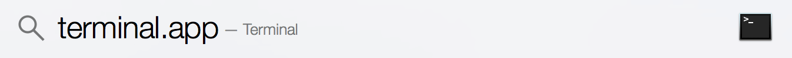
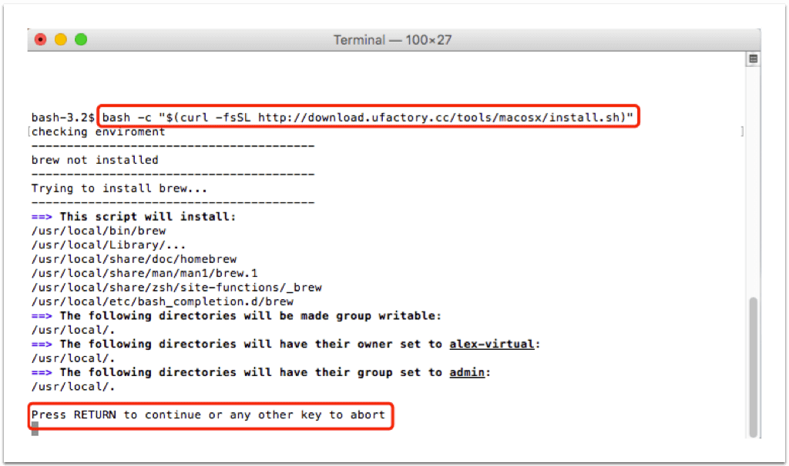
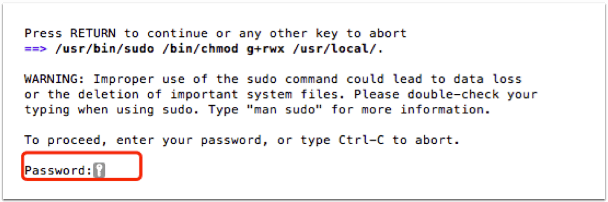
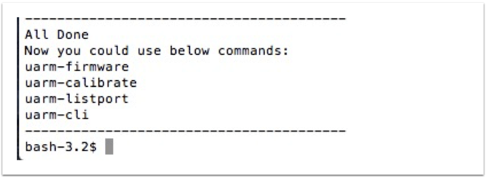

这个教程会帮助你安装 uArm cli (命令行工具)

## Windows

### 依赖

- Windows 7 或者以上
- 管理员权限

### 在线安装
- 用管理员权限打开`Powershell`  
<br>
  
pic1. Run as administrator
<br>  

- Powershell 的默认脚本执行策略，是 **restrict** ，这意味着默认下你是无法执行任何的脚本（只支持单行命令）。所以在下载和执行脚本之前，你需要更改默认的powershell 执行权限，首先你要在powershell输入 `Set-ExecutionPolicy unrestricted`, 然后按   **A** 全部同意

    _更多的执行权限信息，你可以参考微软的文献_ - [Get-ExecutionPolicy](https://go.microsoft.com/fwlink/?LinkID=135170)
<br>  
  
<br>
- 更改完权限以后，请复制以下的指令到 powershell 的窗口中执行
```iex ((New-Object System.Net.WebClient).DownloadString('http://download.ufactory.cc/tools/windows/install.ps1'))```


    _使用代理_  
    _在线脚本支持代理，如果你要使用代理请在执行脚本之前，请先在 powershell 窗口个中执行以下指令：_
    ```$env:chocolateyProxyLocation = 'http://address:port'```  
    _address 以及 port 请更改为对应的IP地址和端口_

    _这个脚本到底做了什么?_  
    - chocolatey, 这是一个自动安装的管理工具，我们用其来安装 python 和 pip. [https://chocolatey.org/][db374d94]  
    - Python2, （安装自 chocolatey），uArm 命令行工具依赖于 python，但是很不幸 windows 本身并不包含 python 运行环境。  
    - pip, (安装自 chocolatey), pip是一个以Python计写成的软件包管理系统。  
    - pyuarm, uArm 的 python 运行库  

  [db374d94]: https://chocolatey.org/ "https://chocolatey.org/"

## MacOS

##### Step 1 - 打开 `terminal.app`  


<center>在spotlight中搜索 `terminal.app`</center>

##### Step 2 - 使用在线脚本安装

**Step 2.1 复制并粘贴以下指令到命令行中:**

```
    bash -c "$(curl -fsSL http://download.ufactory.cc/tools/macosx/install.sh)"
```
<br>

<br>
- 在出现这条信息的时候按下回车键: _Press RETURN to continue or any other key to abort_
<br>
<br>

<br>
- 请在此情况输入你的Mac OS 密码
<br>
<br>
<br>
**Step 2.2 接下耐心等待安装，如果安装成功你会看到以下信息:**

<br>
<br>
**Step 2.3 安装完后，你就可以使用以下指令:**    
- `uarm-listport` - 显示所有已经连接的 uArm  
- `uarm-firmware` - 更新最新 uArm 固件  
- `uarm-calibrate` - 校正 uArm  
- `uarm-cli` - uArm 迷你控制终端
<br>
