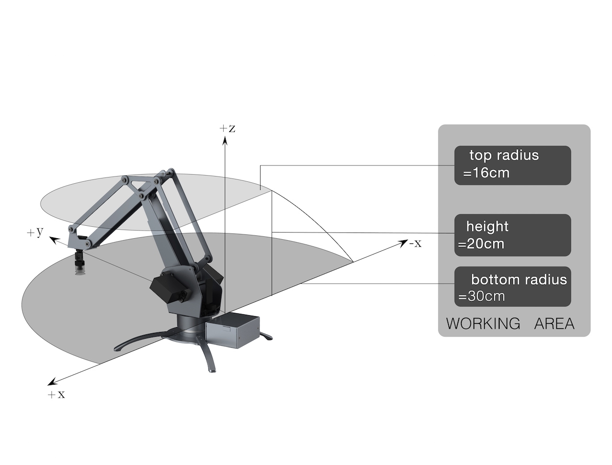
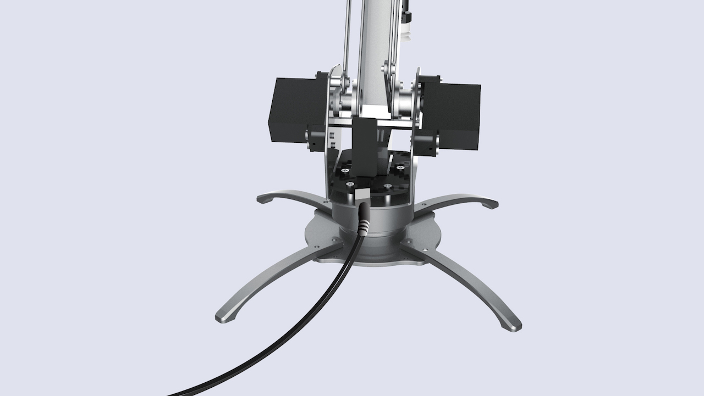

# uArm Metal Getting Started Guide #

2016.06


## Saftey Instructions

- Please don’t put your hands in the highlighted area.


- When uArm is moving, please ensure that nothing that may get hurt or broken is within uArm’s moving range.


## uArm Metal Parts List

<center>Check if you get all of the following parts</center>
  
<br>
1. uArm Metal main body  
2. Power Adapter x1  
3. AC Cable x1  
4. Pump x1 (with 2 screws)   
5. USB Cable x1  
6. Foot brackets x 4(with 8 screws)  
7. Screw Driver x1  
<br>
<br>
## Assembly Instructions
<br>
<br>
<center>**Step 1** Install the 4 foot brackets</center>

<center>Please be aware the screws should be inserted from the bottom to top.</center>
<br>
<center>**Step 2** Install the Pump</center>
  
<center>2.1 Insert 2 screws to install the pump</center>
<br>

<center>2.2 Attach the Cable and the Pipe</center>

## Operation Instructions
### Preparation
1. Power On

<center>If the RED light is on, the uArm is powered.</center>
<br>
2. Connect uArm to computer with USB


### Software Installation
The installation method on Windows, MacOS and Linux are different. Please directly go to the section relevant to you.

[Windows](#w)  
[MacOS](#m)  
[Linux](#linux)

#### <a name="w"></a>Windows

##### Step 1 - Download

Please download the following softwares from the official download page:  

- **Driver** - You need to install this driver before you start everything on Windows
- **uClient** - the software that you operate to control the movement of uArm
- **Firmware Helper** - to enable uArm to recognize the operations you made via uClient
    Upgrade your firmware.
- **Calibration Tool** (for DEVELOPERS) - Your uArm has been calibrated by default. Please DON'T calibrate uArm by yourself UNTIL

Click on **"Getting Started Pack"** on the download page and you will get all softwares above.

##### Step 2 - Intall the Driver  
<br>

<center>**Step 2.1** - unzip the driver file and run _driver.exe_</center>
<br>
<br>

  

<center>**Step 2.2** - Follow the instructions to install the driver.</center>


##### Step 3 – Ensure the firmware is the latest version


<center>**Step 3.1** – unzip the firmware file and run *firmware_helper_exe*</center>
<br>

<center>**Step 3.2** – Check the firmware & ensure it is the lastest version</center>
- You will get your uArm port No. and whether your firmware is the latest version at this step.  
- If the firmware is not the latest, enter "Y" to update.  
- After that, Press Enter to Exit.  
<br>

##### Step 4 – Prepare JRE for uClient (for first-time users)


<center>**Step 4.1** – Click on uClient.exe to launch the APP</center>

<center>


</center>

<center>**Step 4.2** – Download JRE (for first-time users)</center>  
- You will be asked to download JRE (Java Runtime Environment) IF your computer does not
have one.
- Press OK , download JRE, and run the exe
- This download requirement will not pop up again after you finish JRE setup.  

#### <a name="m"></a>MacOS  
##### Step 1 - Open `terminal.app`  
<br>

<center>Search `terminal.app` via Spotlight Search</center>

##### Step 2 - Enter Command to Start Installation

**2.1 Copy & paste the command below to install uArm Enviroment:**

`
    bash -c "$(curl -fsSL http://download.ufactory.cc/tools/macosx/install.sh)"
`


<center>
  
<br>

<br>
<br>
<br>
</center>
**2.2 When the installation is finished, you will see the words below:**
<center></center>
<br>
**2.3 After installation, you could use commands below:**    
- `uarm-firmware` - upgrade your uArm firmware  
- `uarm-listport` - show all connected uArm  
<br>
<center></center>

##### Step 3 - Download uClient
**Please download uClient from our official website.  **  <center>

Change the privacy setting on your Mac  
(or you are not able to run uClient)
<br>
<br>
  
Run `uarm_client.exe`


</center>


#### <a name="linux"></a>Linux

##### Step 1 Install pip & avrdude
Before installing the uArm Environment, you need to install:
- pip
- avrdude

via your **Package Management Tool** (`apt`, `yum`, etc):

Example:  
`
sudo apt-get install python-pip python-dev build-essential avrdude
`

##### Step 2 Install uArm Environment
Input the command below to install:

```
pip install pyuarm
```

Done!   
You could use following commands in your future usage:
- `uarm-firmware` - upgrade your uArm firmware   
- `uarm-listport` - show all connected uArm  
<br>
### Control uArm via uClient
#### Step 1 – Select the right COM and Click *Connect*


- COM No. for uArm may vary.  
- Click *Rescan* if uClient does not detect the COM for uArm.  
- If there are blue lights flashing, uArm is connected with uClient, and you don’t need to click
*Connect* again.

#### Step 2 – Familiarize with uClient


**
1 － Control uArm movement along X, Y, Z Axis.  
<br>
2 － Control the end-effector (Suction Cup/Gripper/Universal Holder)  
**  

＊ You may rotate the suction cup from 0° to 180° by moving the yellow line. Rotation does not
apply to Gripper or Universal Holder.  

＊ Click *Catch/Release* to pick/release (for suction cup) or grab/release (for gripper).
*Catch/Release* does not apply to Universal Holder

**3 － Leap Motion Control (alternative to mouse control)**  

IF you have a Leap Motion Controller, you may control uArm in this way.
<center></center>
<br>
**To enable Leap Motion Control, please:**  

① Connect Leap Motion Controller to PC, and tick the box in uClient  

② Place the Leap Motion Controller in a way that you are facing the flashing GREEN light
<center></center>
<br>
③ Ensure that you have downloaded Leap Motion APP (for PC)

**Leap Motion is activated when the uClient interface displays the following:**  

<center>You may change the minimum Z value of Leap Motion Control.</center>
<br>
**4 － You may reset uArm to the default position.**  


## Community Support
<center>
Welcome to the uArm Community!
<center>
[Customer Service](http://customer.ufactory.cc/)
<center>
[Official Forum](https://forum.ufactory.cc/)
</center>
<br><center>
[Reddit](https://www.reddit.com/r/uArm ) | [Youtube](https://www.youtube.com/channel/UCyy5ekYtq35jFtPpY3O_tVA ) | [Facebook](https://www.facebook.com/Ufactory2013) | [Twitter](https://twitter.com/UFACTORY_UF ) | [Instagram](https://www.instagram.com/ufactoryofficial/)  
