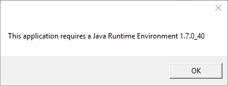

# uArm Metal Getting Started Guide #

2016.06


## Saftey Instructions ##

- Please don’t put your hands in the highlighted area.


- When uArm is moving, please ensure that nothing that may get hurt or broken is within uArm’s moving range.


## uArm Metal Parts List ##

<center>Check if you get all of the following parts</center>
  
<br>
1. uArm Metal main body  
2. Power Adapter x1  
3. AC Cable x1  
4. Pump x1 (with 2 screws)   
5. USB Cable x1  
6. Foot brackets x 4(with 8 screws)  
7. Screw Driver x1
<br>
<br>
## Assembly Instructions
<br>
<center>**Step 1** Install the 4 foot brackets</center>

<center>Please be aware the screws should be inserted from the bottom to top.</center>
<br>
<center>**Step 2** Install the Pump</center>
  
<center>2.1 Insert 2 screws to install the pump</center>
<br>

<center>2.2 Attach the Cable and the Pipe</center>

## Operation Instructions
### Preparation
1. Power On

<center>If the RED light is on, the uArm is powered.</center>
<br>
2. Connect uArm to computer with USB


### Software Installation
(description)

#### Windows

##### Step 1 - Download

Please download the following softwares from the official download page:  

- **Driver** - You need to install this driver before you start everything on Windows
- **uClient** - the software that you operate to control the movement of uArm
- **Firmware Helper** - to enable uArm to recognize the operations you made via uClient
    Upgrade your firmware.
- **Calibration Tool** (for DEVELOPERS) - Your uArm has been calibrated by default. Please DON'T calibrate uArm by yourself UNTIL

Click on **"Getting Started Pack"** on the download page and you will get all softwares above.

##### Step 2 - Intall the Driver  
<br>

<center>**Step 2.1** - unzip the driver file and run _driver.exe_</center>


  

<center>**Step 2.2** - Follow the instructions to install the driver.</center>


##### Step 3 – Ensure the firmware is the latest version


<center>**Step 3.1** – unzip the firmware file and run *firmware_helper_exe*</center>
<br>

<center>**Step 3.2** – Check the firmware & ensure it is the lastest version</center>
- You will get your uArm port No. and whether your firmware is the latest version at this step.
- If the firmware is not the latest, enter "Y" to update.
- After that, Press Enter to Exit.

##### Step 4 – Connect uArm to uClient


<center>**Step 4.1** – Click on uClient.exe to launch the APP</center>

<center>


</center>

<center>**Step 4.2** – Download JRE (for first-time users)</center>  
- You will be asked to download JRE (Java Runtime Environment) IF your computer does not
have one.
- Press OK , download JRE, and run the exe
- This download requirement will not pop up again after you finish JRE setup.


<center>**Step 4.3** – Select the right COM AND Click Connect</center>
- COM No. for uArm may vary.
- Click *Rescan* if uClient does not detect the COM for uArm.
- If there are blue lights flashing, uArm is connected with uClient, and you don’t need to click
*Connect* again.

##### Step 5 – Control uArm via uClient

1. Control uArm movement along X, Y, Z Axis.

2. Control the end-effector (Suction Cup/Gripper/Universal Holder)
<br>
()You may rotate the suction cup from 0° to 180° by moving the yellow line. Rotation does not
apply to Gripper or Universal Holder.
()Click *Catch/Release* to pick/release (for suction cup) or grab/release (for gripper).
*Catch/Release* does not apply to Universal Holder
<br>
3. Leap Motion Control (alternative to mouse control)
IF you have a Leap Motion Controller, you may control uArm in this way.
<center></center>
<br>
**To enable Leap Motion Control, please:**  

① Connect Leap Motion Controller to PC, and tick the box in uClient  

② Place the Leap Motion Controller in a way that you are facing the flashing GREEN light
<center></center>
<br>
③ Ensure that you have downloaded Leap Motion APP (for PC)

**Leap Motion is activated when the uClient interface displays the following:**  

<center>You may change the minimum Z value of Leap Motion Control.</center>
<br>
4. You may reset uArm to the default position.

#### Mac
##### Step 1 -
You could use below command to install all uArm Enviroment, Please open `terimnal.app`, then copy & paste below command install uArm Enviroment.

```
    bash -c "$(curl -fsSL http://download.ufactory.cc/tools/macosx/install.sh)"
```

It would require you input your password several times to proceed.

After Done.
You could use below commands.  
- `uarm-firmware` - upgrade your uArm firmware  
- `uarm-calibrate` - calibrate your uArm  
- `uarm-listport` - show all connected uArm  


#### Linux

Requirement:  
- pip  
- avrdude  

You could use `apt` or `yum` something like **Package Management Tool**

```
sudo apt-get install python-pip python-dev build-essential avrdude
```

After installed the Requirement package, please use below command to install uArm Enviroment

```
pip install pyuarm
```

After Done.You could use below commands.  
- `uarm-firmware` - upgrade your uArm firmware  
- `uarm-calibrate` - calibrate your uArm  
- `uarm-listport` - show all connected uArm  


## Community Support
Welcome to the uArm Community!
Now, start your journey with robot enthusiasts, makers, artists and scientists all around the world.
Official Forum: https://forum.ufactory.cc/

reddit
Youtube
instructables
Facebook
Twitter
Instagram
