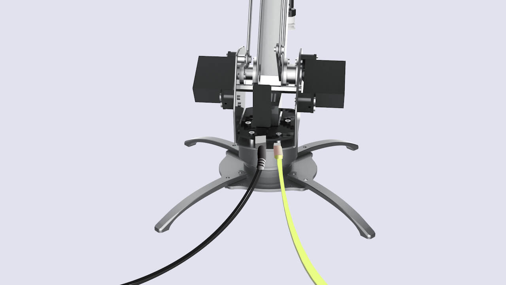

# uArm Metal 快速入门指南 #

2016.06
<center>

</center>

# 目录
1. [安全须知](#Safety)
2. [配件清单](#Parts)
3. [安装说明](#Assembly)
4. [操作说明](#Operation)  
   4.1 [准备就绪](#Preparation)  
   4.2 [安装软件](#Software)  
   4.3 [uClient操作说明](#uClient)  
5. [社区支持](#Community)

## 安全须知 <a name="Safety"></a>

- 手动操作uArm时，请不要将手放入黄色区域内。
<center></center>

- 操作uArm前，请清理uArm周围环境，给uArm留出足够的活动空间（活动范围入下图），以免uArm在活动过程中毁坏物品或撞到操作者/旁观者。
<center></center>


## 配件清单 <a name="Parts"></a>

<center>开箱时请检查您是否已拿到以下必需配件：</center>

<center></center>
<br>
1. uArm Metal机身  
2. 电源 x1  
3. 电源线 x1  
4. 气泵 x1 （附2颗安装螺丝）  
5. USB线 x1  
6. 脚部支撑 x 4 (附8颗安装螺丝)  
7. 螺丝刀 x1  
<br>

## 安装说明 <a name="Assembly"></a>

<center>**第 1 步** 安装脚部支撑</center>
<center></center>
<center>请自下而上安装螺丝</center>
<br>
<br>
<center>**第 2 步** 安装气泵</center>
<center></center>
<center>2.1 - 用2颗螺丝将气泵安装在底座上</center>
<br>
<br>
<center></center>
<center>2.2 - 如图，将气管和黑色线缆接到气泵上</center>

## 操作说明 <a name="Operation"></a>
### 准备工作 <a name="Preparation"></a>
1. 接通电源
<center></center>
<center>红灯亮起即已接通电源</center>
<br>
<br>
2. 用USB将uArm连接到电脑
<center></center>

### 安装软件 <a name="Software"></a>
不同操作系统上的软件安装方式不同，请直接阅读与您相关的部分。

1. [Windows](#Windows)
2. [MacOS](#MacOS)
3. [Linux](#Linux)

#### Windows <a name="Windows"></a>

##### 第 1 步 - 下载

请在[下载中心](https://ufactory.cc/en/uarm_metal?tag=download#support)下载以下软件

- **驱动** - 这是uArm软件在Windows系统上运转的前提
- **uClient客户端** - 您将使用此软件控制uArm的运动
- **固件** - 确保uArm能正确理解您在uClient发出的指令


##### 第 2 步 - 安装驱动
<br>
<center></center>  
<center>**2.1** - 解压，运行_driver.exe_</center>
<br>
<br>
<center></center>
<center></center>

<center>**2.2** - 根据指引安装驱动.</center>


##### 第 3 步 – 安装及更新固件

<center></center>  
<center>**3.1** – 解压，运行*firmware_helper_exe*</center>
<br>
<center></center>  
<center>**3.2** – 检查固件，确保已是最新版本</center>
（固件会不定时更新，最新版本号以您看到的弹窗实际所示为准）
- 窗口将自动显示：1) uArm 端口号；2）现有固件版本，以及最新固件版本
- 如果您的固件不是最新版本，输入“Y”开始更新
- 以上步骤完成后，点击回车键退出

<br>

##### 第 4 步 – 安装JRE (仅在第一次安装uClient时需要)

<center></center>  
<center>**4.1** – 运行*uClient.exe*</center>
<br>
<center></center>
<center></center>  

<center>**4.2** – 下载JRE</center>
<br>
- 如果您是第一次安装uClient，且电脑没有JRE，会有弹出窗口提示您安装
- 点击OK，自动跳转至JRE下载页面，下载JRE并运行
- 安装完成后，运行uClient时将不会再出现该弹窗

<br>
<br>
#### MacOS <a name="MacOS"></a>

##### 第 1 步 - 打开 `terminal.app`
<br>
<center></center>
<center>Search `terminal.app` via Spotlight Search</center>

##### 第 2 步 - 输入命令，开始安装

**2.1 将以下命令复制黏贴到terminal，启动安装进程:**

`
    bash -c "$(curl -fsSL http://download.ufactory.cc/tools/macosx/install.sh)"
`

<center></center>
<br>
<center></center>
<br>
<br>
<br>
**Step 2.2 安装完成后，您会看到以下页面:**
<center></center>
<br>
**Step 2.3 安装完成后，您可随时使用以下命令:**
- `uarm-firmware` - 检查、更新uArm固件
- `uarm-listport` - 列出所有已连接的uArm
<br>
<br>
<center></center>

##### 第 3 步 - 下载uClient客户端
**请在[下载中心](https://ufactory.cc/en/uarm_metal?tag=download#support)下载uClient**
<center></center>
<center>请先暂时更改您Macbook上的安全设置 (否则将无法运行uClient)</center>
<br>
<br>
<center>
双击运行 `uarm_client.exe`，玩得开心！</center>


<br>
#### Linux <a name="Linux"></a>

##### 第 1 步 － 安装pip & avrdude
在安装uArm软件环境前，您需要先用Linux的软件包管理工具（如`apt`, `yum`等等）安装:
- pip
- avrdude

举例:
`
sudo apt-get install python-pip python-dev build-essential avrdude
`

##### 第 2 步 － 安装uArm软件环境
输入以下命令，开始安装

```
pip install pyuarm
```

安装完成后，您可随时使用以下命令
- `uarm-firmware` - 检查、更新uArm固件
- `uarm-listport` - 列出所有已连接uArm

<br>
### uClient操作说明 <a name="uClient"></a>
#### 第 1 步 – 选择uArm端口号，单击*Connect*

<center></center>
<br>
- 若uClient没有检测到您的uArm端口，请点击*Rescan*
- 蓝灯闪烁即说明uArm已接通uClient，无需重复点击*Connect*
<br>

#### 第 2 步 – 用uClient控制uArm
<center></center>


**1 － 控制uArm在 X, Y, Z轴上的运动**
<br>
**2 － 控制机械臂末端（吸头/夹具/笔夹）运动**


- 移动黄色线可旋转吸头（范围：0° －180°）。夹具和笔夹不可旋转。
- 点击 Catch/Release ：1）吸头－吸住/松开；2）夹具：夹紧/松开。笔夹为机械夹具，无需软
件控制。

**3 － 通过第三方体感控制器－Leap Motion控制 (除鼠标控制外的另一种控制方式)**

如果您有Leap Motion控制器，您可用体感控制 uArm。
<center></center>
<br>
**使用 Leap Motion 控制 uArm 前请确保：**

① Leap Motion控制器已连接到电脑，且您已在uClient勾选对应方框。

② 将Leap Motion控制器按图示位置摆放（您须面向绿灯）。
<center></center>
<br>
③ 您已下载Leap Motion电脑端APP。（关于Leap Motion的更多信息请参考LM官网）

**当 uClient 界面如下图所示，您就可以开始用体感控制 uArm 了！**
<center></center>
<center>您可拖动Minimum Z数值条改变uArm在 Leap Motion控制中的Z轴最低点</center>
<br>
<br>
**4 － 您可随时将uArm重置到初始位置。**


## 社区支持 <a name="Community"></a>

<center>欢迎来到uArm社区!</center>
<br>
<center>[常见问题]()</center>
<br>
<center>[客服通道](http://customer.ufactory.cc/)</center>
<br>
<center>[开发者指南](http://pan.baidu.com/s/1misAu2s)</center>
<br>
<center>[官方论坛](https://forum.ufactory.cc/)</center>
<br>
<center>  
扫一扫，关注uArm微信公众号</center>
<br>
<center>[微博](http://weibo.com/u/3925641670?topnav=1&wvr=6&topsug=1&is_all=1) | [优酷](http://i.youku.com/i/UMzY4Njk1NTQ2OA==) | [腾讯视频](http://v.qq.com/vplus/6c4792a45937ca8ef893016a79843b0d)
