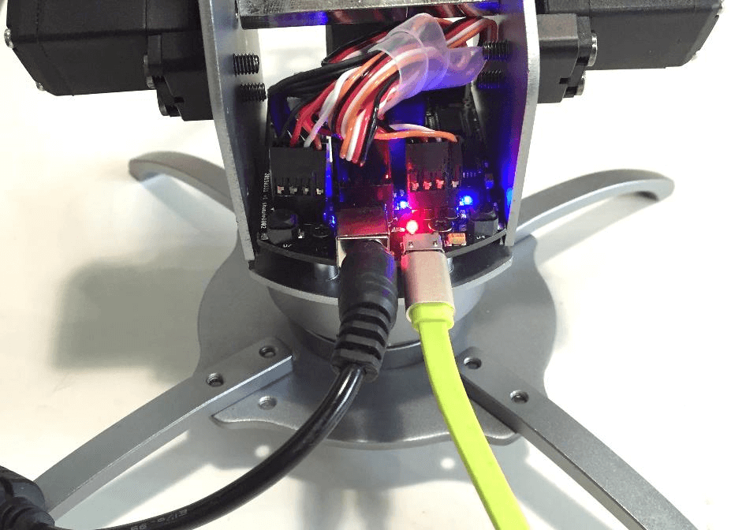
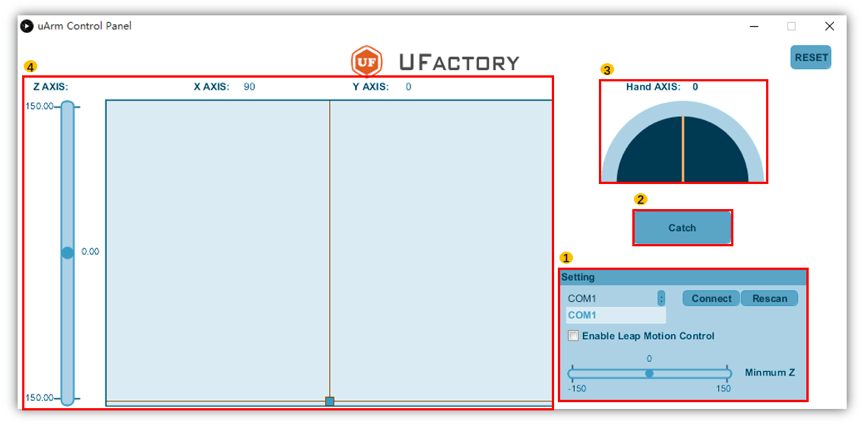

# Documentation
## uArm Metal Getting Started Guide
## uArm Metal Getting Started Guide

1. Installation Guide
    - Screw foot brackets.  
    Please be aware the screw is inserted from the bottom to top.

    - Screw pump box.

    - Connect gas tube and pump cable.

2. Plug in Charger  
    Plug charger to uArm Metal. If you see the red light is on, it means uArm is charged.

3. Connect uArm to computer

    - Connect uArm to computer with USB cable.  
    
    - Insert Bluetooth Module. *(optional)*  

        If you have Bluetooth package with your
        uArm, you can plug the 4-pin Bluetooth module to uArm, and plug the USB Bluetooth module to your computer. The two modules will automatically start to pair, and the blue light will stay on as long as two modules are pairing.

USB cable and Bluetooth module must not connect to uArm at the same time  

4. Install Driver

    Please download the right Driver for uArm. We have provided Mac, Linux and Windows Operation Systems. As for Windows users, it is necessary to download and install Driver.

5. uArm Client

    - Download uArm Client
    Please choose a uClient for your Operation System. We have provided Mac, Linux and Windows Operation Systems.
    - uClient GUI.

        
        1. Setting   

        

        2. You can try other control methods, like Leap Motion.  

        
        3. Catch/ Release Bottom  
        Catch and release bottom is used to control the end effector’s mode of uArm metal.
        4. Hand Axis
        Control the rotation movement of pump’s sucker. The working area is 0-180°.
        5. Arm’s movement control panel
        (X,Y,Z) is the coordination in the three-dimension area. The range for X, Y, Z is
        respectively, 0-180°, 0-210°, -150-150°. 5-4 Now, let’s start to work it out.  

        Open uArm Client on your computer. In the setting, you need first select the COM port, and connect. Meanwhile, please make sure the rest options are not selected. Now, you can drag the sliders on the left (X,Y,Z) panel to control uArm.  

        If you want to use other input controllers like Leap Motion, you have to install their official drivers first and select the corresponding option in the setting area. Using Leap Motion as an example, after you successfully connect to Leap Motion, you should see the sketch graph of your hand on the panel.  

        Now you are ready to use your uArm!      

6. Firmware

    Always check if have the downloaded the latest firmware. Always keep an eye on our driver update!

7. Detailed Specification of Metal

    Maybe you need to check specifications, we have provided you the reference in the download sector.

8. If you have any other problems, please contact us.

- **Forum** https://forum.ufactory.cc/  
- **Ticket** https://in.ufactory.cc/osticket/upload/  

