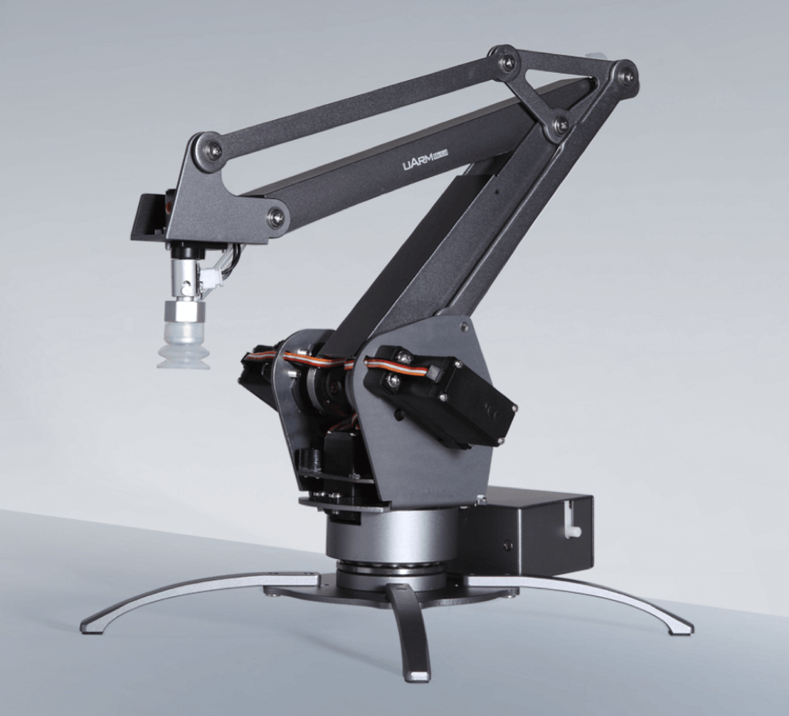

# uArm Metal Getting Started Guide




## Saftey Instructions

- Please don’t put your hands in the highlighted area.
- When uArm is moving, please ensure that nothing that may get hurt or broken is within uArm’s moving range.


## Introduction of uArm Metal

### In-the-box Parts List

<center>Check if you get all of the following parts</center>

<center>
1. uArm Metal main body
2. Power Adapter x1
3. AC Cable x1
4. Pump x1 (with 2 screws)
5. USB Cable x1
6. Foot brackets x 4(with 8 screws)
7. Screw Driver x1
</center>

## Assembly Instructions

1. Install the 4 foot brackets
<center>Please be aware the screws should be inserted from the bottom to top.</center>
2. Install the Pump
3. Insert 2 screws to install the pump
4. Attach the Cable and the Pipe

## Operation Instructions
1. Power On
<center>If the RED light is on, the uArm is powered.</center>
2. Connect uArm to computer with USB

### Software Installation

#### Windows

- Driver - You need to install this driver before you start everything on Windows
    Install Driver
- Firmware Helper - Help you upgrade your uArm's firmware
    Upgrade your firmware.
- uClient - the software that you operate to control the movement of uArm
- *Calibrate* - Help you calibrate your uArm. (your uArm has been calibrated by default, we don't recommend that you calibrate by yourself)

#### Mac

Please open `terimnal.app`, then copy & paste below command install uArm Enviroment.

```
    bash -c "$(curl -fsSL http://download.ufactory.cc/tools/macosx/install.sh)"
```

It would require you input your password several times to proceed.

After Done.
You could use below commands.  
- `uarm-firmware` - upgrade your uArm firmware  
- `uarm-calibrate` - calibrate your uArm  
- `uarm-listport` - show all connected uArm  


#### Linux

Requirement:  
- pip  
- avrdude  

You could use `apt` or `yum` something like **Package Management Tool**

```
sudo apt-get install python-pip python-dev build-essential avrdude
```

After installed the Requirement package, please use `pip install pyuarm` install uArm Enviroment

After Done.You could use below commands.  
- `uarm-firmware` - upgrade your uArm firmware
- `uarm-calibrate` - calibrate your uArm  
- `uarm-listport` - show all connected uArm  
