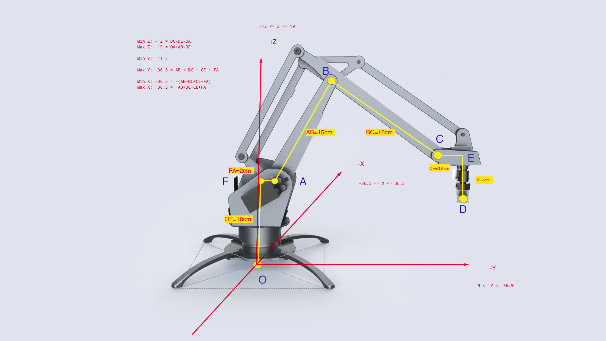

# 开发者指南 Developer Instruction

## uArm 基本教程
如果你刷的是我们的通用固件，我们在固件里面包括了uArm Library 还有uArm Protocol 通信协议。
uArm 在通电以后  
1. 会读取当前的角度，然后会attach所有电机。  
    *如果uArm没有校正，它会发出一声长鸣，要求你进行校正。你可以使用我们的开发者工具`uarm-calibrate`*  
2. 然后uArm就自动进入准备状态，如果这个时候你发送了指令（通过uArmProtocol协议），uArm自动进行解析，并执行相应的动作，如果你希望自己书写与uArm通信，你可以参照通信协议  
3. 我们更推荐的方式使用我们已经封装好的API接口，你无需要再去理解复杂的协议，并且也无需要学习串口编程。上手即可用。  
4. 在你开始任何项目之前，请认真阅读以下的指南，不能说百分之百解决你遇到的问题，但是起码你有一些基本的知识。  

## 机械运动 Mechanical Motion

### 电机示意图
uArm 是通过4个电机来运动的。如下图所示

图1.0 电机示意图

- Servo 0 - Bottom Servo
对应的Arduino PWM PIN D11, Analog PIN 2
这个电机控制uArm的地盘旋转

- Servo 1 - Left Servo -
对应的Arduino PWM PIN D13，Analog PIN 0
Servo 2 - Right Servo
对应的Arduino PWM PIN D12, Analog PIN 1
这两个电机控制uArm的前臂`Link1`与后臂`Link2`的运动  

- Servo 3 - Hand Servo -
对应的Arduino PWM PIN D10, Analog PIN 3
这个小电机控制uArm前端，吸头(Suction cup)的角度旋转

### 电机

说到电机的控制，就要提到Arduino，众所周知，uArm是开源的机械臂。这得益于Arduino的开源。我们可以很方便的使用成千上万的开源库。而我们选用的电机是可以支持Arduino的servo.h库

#### 电机 Attach Detach

在使用电机前，都必须对电机进行attach，此时电机会锁住。默认的Arduino里面

#### 电机的转动范围

我们使用的电机默认使用默认的`servoWrite()`函数，每个电机的操作单位是度，范围从`0`度到`180`度。在装配的时候，我们都是依照固定的度数把电机安装到机械臂上的。
下图是机械臂默认的安装度数

 1.1 电机角度图 

- Servo 0 是90度，它处与中间位置  
- Servo 1 和 Servo 2 都是处于 90度的位置
- Servo 3 也是处于90度位置

虽然电机的活动范围是从0到180度，但是，由于机械结构的限制，在使用的时候，左右的电机的活动范围是没有这么大的范围的。

下图是左右电机的活动范围（单独一个电机运动时）。左边大概是150度到0度的范围，右边大概是20度到150度的范围
左右电机转动范围

底部的电机，和前端的电机都是0到180度，比较简单。如下图
底部电机，与前端电机的转动范围

但是左右的电机联动的时候，两个联动的活动范围是一个下图这样的面积。
左右电机运动范围图

通过以上的内容，你就可以直接通过各个电机的角度去控制机械臂的运动，但是这很不直观，也很**危险**，因为左右电机的联动互相锁死，很容易把电机`烧毁`。所以我们建立一个三维坐标系，详情请参照后面的，三维坐标系

### 读取电机角度
我们的使用的电机，内置了ADC（模拟数字转换器），可以把当前的角度模拟信号转换成数字，Arduino已经默认内置了`analogRead()`函数，读出来的数值，通过这个公式可以得出当前的角度，`intercept + analog * slope`，intercept与slope的涵义，在后面的**校正**中详细说明。

### 校正

###### 为什么需要校正？
1. 首先，ADC采样的Analog数据是有偏差的，每个电机的偏差都不一样，所以我们需要对每个电机做一次线性度的校验。

    - 我们现在的做法是让电机走到目标位置，并通过ADC收集5次Analog的平均值，通常采点都在100个点以上
    - 然后把收集的数据，做一个线性运算，得出`intercept`和`slope`的值。

2. 其次，一般我们都会以固定角度把电机安装到机械臂上。就如 电机控制里图2一样，但是，所有的机械臂都是人工装配的，所以会有人工装配误差。这个误差也需要用人手去测量。

###### 如何校正
在开发者工具的section会专门介绍校正的工具。

### 三维坐标系

直接控制全部电机的转动，可以很直接的控制uArm的运动，但是很不直观，也很危险。所以我们建立一个三维坐标系(x,y,z)，以`厘米`为单位。请看下图

图1.1 坐标系示意图

上图详细标注了uArm的六个连接点(O, A, B, C, D, E)，以及5个连接线(OA, AB, BC, CD, DE)之间的长度，X, Y, Z的最大最小值。

#### 连接点：  
- O 原点 也就是 (0,0,0)
- A（左右）电机的轴心中间的那个点
- B 连接前后臂的螺丝位置（准确说是两个螺丝的中间点）
- C 连接前臂与前端的螺丝位置 （同上）
- D 吸头底部的中间点
- E 点其实是不存在，是C的平行线与E的垂直线的交点

#### 连接线
- OA = 10 cm  轴心到原点的高度
- AB = 15 cm  后臂长
- BC = 16 cm  前臂长
- CE = 3.5 cm 前端长
- DE = 6 cm   吸头高度

#### 极限值
- X 的范围：-34.5cm ~ 34.5cm
    Max X =  AB + BC + CD

- Y 的范围：9cm ~ 34.5cm，
    Max Y = Max X

    AB，BC，AC形成的一个直角三角形，BAC为直角。如以上公式：

- Z 的范围：-12cm ~ 19cm  
    Max Z = OA + AB -DE
    Min Z = BC - DE - OA

#### 活动范围
