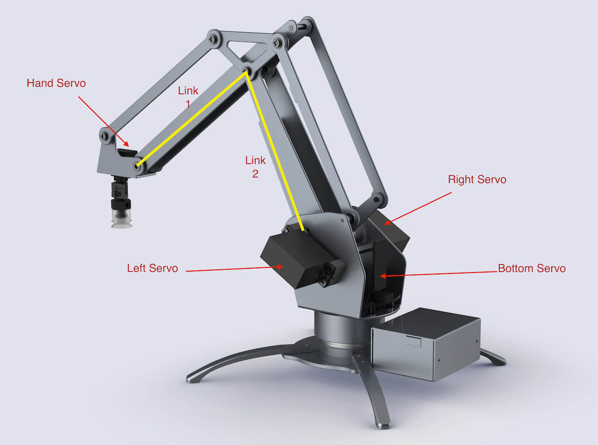

# 开发者指南 Developer Instruction


<!-- TOC depthFrom:1 depthTo:6 withLinks:1 updateOnSave:1 orderedList:0 -->

- [开发者指南 Developer Instruction](#开发者指南-developer-instruction)
	- [uArm 基本知识讲解](#uarm-基本知识讲解)
	- [机械运动 Mechanical Motion](#机械运动-mechanical-motion)
		- [电机示意图](#电机示意图)
		- [电机](#电机)
			- [电机 Attach Detach](#电机-attach-detach)
			- [电机的转动范围](#电机的转动范围)
		- [读取电机角度](#读取电机角度)
		- [校正](#校正)
					- [为什么需要校正？](#为什么需要校正)
					- [如何校正](#如何校正)
		- [三维坐标系](#三维坐标系)
			- [连接点：](#连接点)
			- [连接线](#连接线)
			- [极限值](#极限值)
			- [活动范围](#活动范围)
			- [精准度与偏差](#精准度与偏差)
	- [uArm套件的使用](#uarm套件的使用)
		- [安装教程](#安装教程)
			- [Windows](#windows)
			- [Mac](#mac)
			- [Linux](#linux)
			- [使用教程](#使用教程)
				- [uarm-firmware 固件帮助程序](#uarm-firmware-固件帮助程序)

<!-- /TOC -->

## uArm 基本知识讲解
如果你刷的是我们的通用固件，我们在固件里面包括了uArm Library 还有uArm Protocol 通信协议。
uArm 在通电以后  

1. 会读取当前的角度，然后会attach所有电机。  
    *如果uArm没有校正，它会发出一声长鸣，要求你进行校正。你可以使用我们的开发者工具`uarm-calibrate`*  

2. 然后uArm就自动进入准备状态，如果这个时候你发送了指令（通过uArmProtocol协议），uArm自动进行解析，并执行相应的动作，如果你希望自己书写与uArm通信，你可以参照通信协议  

3. 我们更推荐的方式使用我们已经封装好的API接口，你无需要再去理解复杂的协议，并且也无需要学习串口编程。上手即可用。  

4. 在你开始任何项目之前，请认真阅读以下的指南，不能说百分之百解决你遇到的问题，但是起码你有一些基本的知识。

## 机械运动 Mechanical Motion

### 电机示意图
uArm 是通过4个电机来运动的。如下图所示

<center>图1.0 电机示意图</center>
- Servo 0 - Bottom Servo
对应的Arduino PWM PIN D11, Analog PIN 2
这个电机控制uArm的地盘旋转

- Servo 1 - Left Servo -
对应的Arduino PWM PIN D13，Analog PIN 0
Servo 2 - Right Servo
对应的Arduino PWM PIN D12, Analog PIN 1
这两个电机控制uArm的前臂`Link1`与后臂`Link2`的运动  

- Servo 3 - Hand Servo -
对应的Arduino PWM PIN D10, Analog PIN 3
这个小电机控制uArm前端，吸头(Suction cup)的角度旋转

### 电机  

说到电机的控制，就要提到Arduino，众所周知，uArm是开源的机械臂。这得益于Arduino的开源。我们可以很方便的使用成千上万的开源库。而我们选用的电机是可以支持Arduino的servo.h库

#### 电机 Attach Detach

在使用电机前，都必须对电机进行attach，此时电机会锁住。默认的Arduino里面

#### 电机的转动范围

我们使用的电机默认使用默认的`servoWrite()`函数，每个电机的操作单位是度，范围从`0`度到`180`度。在装配的时候，我们都是依照固定的度数把电机安装到机械臂上的。
下图是机械臂默认的安装度数

<center> 1.1 电机角度图 </center>
- Servo 0 是90度，它处与中间位置  
- Servo 1 和 Servo 2 都是处于 90度的位置
- Servo 3 也是处于90度位置

虽然电机的活动范围是从0到180度，但是，由于机械结构的限制，在使用的时候，左右的电机的活动范围是没有这么大的范围的。

下图是左右电机的活动范围（单独一个电机运动时）。左边大概是150度到0度的范围，右边大概是20度到150度的范围
左右电机转动范围

底部的电机，和前端的电机都是0到180度，比较简单。如下图
底部电机，与前端电机的转动范围

但是左右的电机联动的时候，两个联动的活动范围是一个下图这样的面积。
左右电机运动范围图

通过以上的内容，你就可以直接通过各个电机的角度去控制机械臂的运动，但是这很不直观，也很**危险**，因为左右电机的联动互相锁死，很容易把电机`烧毁`。所以我们建立一个三维坐标系，详情请参照后面的，三维坐标系

### 读取电机角度
我们的使用的电机，内置了ADC（模拟数字转换器），可以把当前的角度模拟信号转换成数字，Arduino已经默认内置了`analogRead()`函数，读出来的数值，通过这个公式可以得出当前的角度，`intercept + analog * slope`，intercept与slope的涵义，在后面的**校正**中详细说明。

### 校正

###### 为什么需要校正？
1. 首先，ADC采样的Analog数据是有偏差的，每个电机的偏差都不一样，所以我们需要对每个电机做一次线性度的校验。

    - 我们现在的做法是让电机走到目标位置，并通过ADC收集5次Analog的平均值，通常采点都在100个点以上
    - 然后把收集的数据，做一个线性运算，得出`intercept`和`slope`的值。

2. 其次，一般我们都会以固定角度把电机安装到机械臂上。就如 电机控制里图2一样，但是，所有的机械臂都是人工装配的，所以会有人工装配误差。这个误差也需要用人手去测量。

###### 如何校正
在开发者工具的section会专门介绍校正的工具。

### 三维坐标系

直接控制全部电机的转动，可以很直接的控制uArm的运动，但是很不直观，也很危险。所以我们建立一个三维坐标系(x,y,z)，以`厘米`为单位。请看下图

<center>图1.2 坐标系示意图</center>
上图详细标注了uArm的六个连接点(O, A, B, C, D, E)，以及5个连接线(OA, AB, BC, CD, DE)之间的长度，X, Y, Z的最大最小值。

#### 连接点：  
- O 原点 也就是 (0,0,0)
- A（左右）电机的轴心中间的那个点
- B 连接前后臂的螺丝位置（准确说是两个螺丝的中间点）
- C 连接前臂与前端的螺丝位置 （同上）
- D 吸头底部的中间点
- E 点是虚构的点，是C的平行线与E的垂直线的交点
- F 点是虚构的点，是O的垂直线与A的平行线的交点

#### 连接线
- OF = 10 cm  原点到左右轴中心的高度
- AF = 2 cm   左右轴中心与原点垂直线的距离
- AB = 14.8 cm  后臂长
- BC = 16 cm  前臂长
- CE = 3.5 cm 前端长
- DE = 6 cm   吸头高度

#### 极限值

- X 的范围：-36.5cm ~ 36.5cm  
    Max X =  AB + BC + CD + AF  

- Y 的范围：11.5 cm ~ 36.5cm   
    Max Y = Max X  
    MIN Y = 

- Z 的范围：-12cm ~ 19cm  
    Max Z = OA + AB -DE  
    Min Z = BC - DE - OA

#### 活动范围

通过上面的极限值，你大概可以想象到，uArm是什么样的一个活动范围。但是uArm 的活动范围是一个不规则的范围。下图是实际uArm的活动范围。有些不能达的目标点是很危险，我们默认会对不能到达的地方做一些限制，并返回一个错误码。(并且我们提供了一个可以检查这个点能不能到达的函数 - Todo)

下图是一个侧面的活动范围，你可能发现，这个活动范围跟极限值有一点偏差。极限值是通过纯理论纯几何方式测量，而这个是用建模软件算出来，有一些机械结构的限制，导致活动范围并没有那么大。（以最大距离来说，最大距离并不是一条直线，会稍微有点弯曲，所以不能完全到达，极限值所在的位置）

<center>图1.3 活动范围侧面图</center>  


下图是俯视的活动范围图，这个距离是以`吸头能吸到桌面`为基准的范围，所以范围变小。

<center>图1.4 俯视活动范围图</center>  

#### 精准度与偏差

理论误差，在`±0.5厘米`，也就是`1厘米`的误差，但实际上跟范围和负载有关系。

电机在`40`度到`140`度之间，误差是比较小，但是在小于`40`和大于`140`度的时候，误差会变得比较大
下面是电机0到180度之间的target走位，与实际走位
<1.4 误差图表>

下图是用电机在这个范围内，误差较小的范围。
<1.5 一个是俯视图，一个侧视图，呈现，所有的电机在40度至140度之间的范围>  

## uArm套件的使用

接下来开始讲解，附带的一些开发工具的讲解。  

我们的uArm套件都是用python写的，目的是辅助用户，专注于开发。

### 安装教程

首先你需要安装uArm 的运行环境

#### Windows

- 由于Windows没有内置python环境，如果你需要使用这些开发套件，你必须先安装python环境。[Python Environment][python-download-link]  
- 然后你需要安装`pip`, 这里推荐[pip-for-windows][pip-for-windows-link]
- 装完pip以后，你就可以通过以下命令`pip install pyuarm`安装uArm的套件。


#### Mac

需要:   
- pip  
- avrdude  

强烈推荐，我们提供了非常方便的一件安装命令：

```
    bash -c "$(curl -fsSL http://download.ufactory.cc/tools/macosx/install.sh)"
```

这个命令会帮你安装所有需要用到的运行环境，非常方便哦。  


如果你希望自己安装，你也按照下面的步骤安装：  
- 首先安装pip - `sudo easy_install pip`  
- 然后安装pyuarm `pip install pyuarm`  
- 如果你需要固件升级固件，你还要需要安装`avrdude`，一个最方便的方法是安装 [Homebrew][Homebrew-link]  
- 安装完homebrew，以后你就可以直接用`brew install avrdude`  


#### Linux

需要：
- pip  
- avrdude  

Linux下可以使用发行版里面的安装工具安装，例如在debain下你可以直接使用：
```
sudo apt-get install python-pip python-dev build-essential avrdude    
```
安装完以后，你就可以使用`pip install pyuarm`安装套件  

#### 使用教程

当你安装了所有的套件以后，你就可以使用一下套件：  

- uarm-firmware 更新固件，查看固件
- uarm-calibrate 校正uarm
- uarm-listport 检查当前可用的uarm端口
- uarm-miniconsole 一个纯命令行的简单控制端软件 (To-Do)

如果上述命令不能用，亦可以使用这种方式：  
- python -m pyuarm.tools.firmware_helper  
- python -m pyuarm.tools.calibrate  
- python -m pyuarm.tools.list_uarms  
- python -m pyuarm.tools.miniconsole  

##### uarm-firmware 固件帮助程序

uarm-firmware 可以帮助你更新固件，查看固件版本，检查最新版本

以下是使用帮助：
```
$ uarm-firmware -h
No uArm is connected.
usage: uarm-firmware [-h] [-d] [-f [FORCE]] [-c [CHECK]] [-p [PORT]]

optional arguments:
  -h, --help            show this help message and exit
  -d, --download        download firmware into firmware.hex
  -f [FORCE], --force [FORCE]
                        without firmware path, flash default firmware.hex,
                        with firmware path, flash the firmware, eg. -f
                        Blink.ino.hex
  -c [CHECK], --check [CHECK]
                        remote - lateset firmware release version, local -
                        read uArm firmware version
  -p [PORT], --port [PORT]
                        provide port number
```

默认不带参数的时候是会对比uArm的版本和远程的版本，如果远端版本比较新，就会提示是否要更新。如果一定要强制更新，你可以使用`uarm-firmware -d` + `uarm-firmware -f`进行强制刷新

 [Homebrew-link]: http://brew.sh "Homebrew"
 [python-download-link]: https://www.python.org/downloads/ "PythonDownloadLink"
 [pip-for-windows-link]: https://sites.google.com/site/pydatalog/python/pip-for-windows "pip-for-windows"
