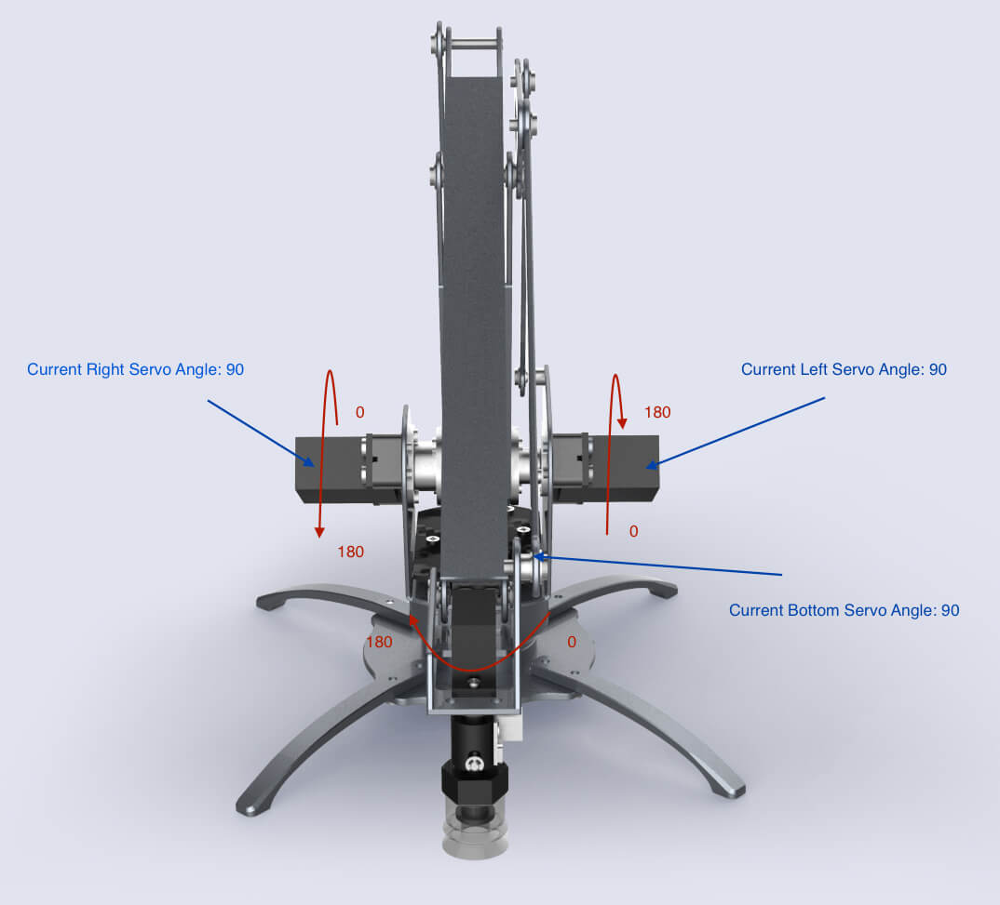
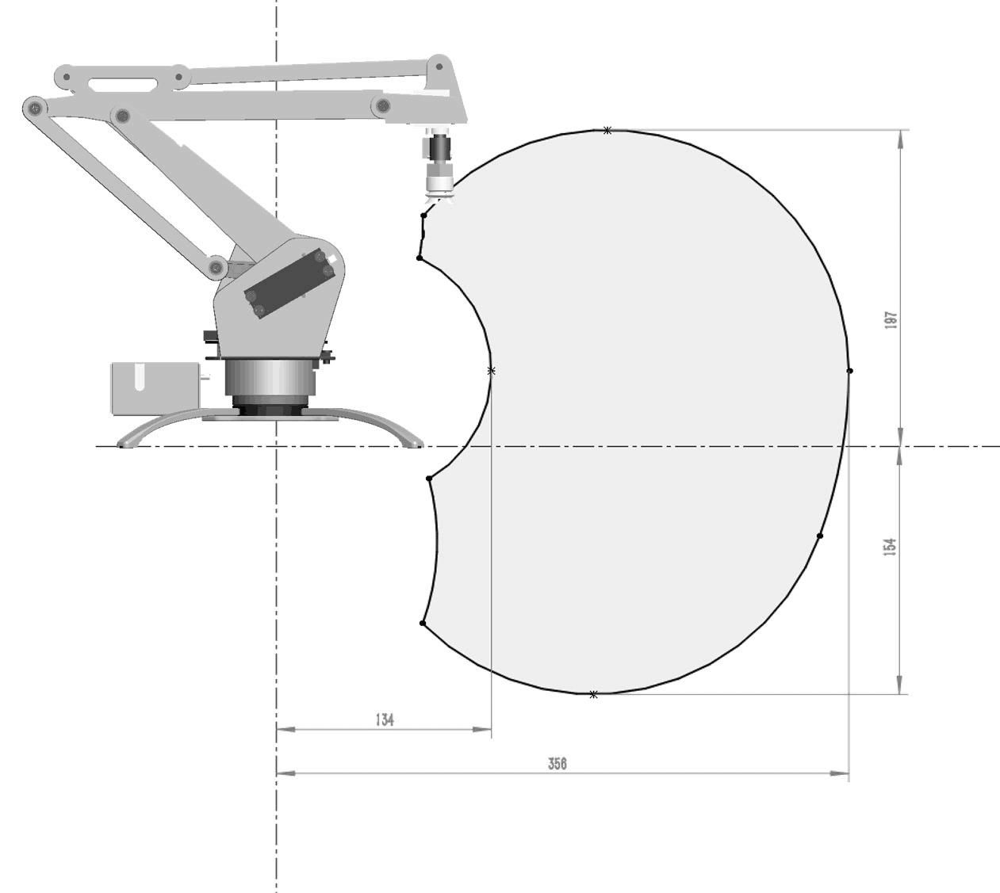

#  uArm Developer Knowledge Base

## Makers are from all jacks of life, so do uArm Masters!
We know you are a developer, but maybe you are an expert of Software Programming, a dedicated Industrial Designer or smart Mechanical Engineer,
who is curious about Robot and eager to learn. We aslo can see many of you are artists, and couldn't find a smart arm to help you to build your creative ideas.

**Here you GO!**

It doesn't matter your background, please arm in arm with us, and trust yourself you can make and hack with uArm.

This is the reason why we start the uArm Knowledge Base! It will simply brief you basic idea of Robots, mechanics concept of uArm, library we create,
 communication with Robots, and so on.

 Of course, as mentioned before, makers are from all jacks of life and everyone is an expert of your own field,
 so we also call for your help to make it a marvelous BASE for everyone to read, study, share, hack  and define your own uArm- Robot Arm :)


## uArm Developer Knowledge Base Introduction

Please update your uArm with our latest firmware at *Download Section* of the [page](https://ufactory.cc/cn/uarm_metal/) at the bottom, and it is included _uArm_ _Library_ and _uArm_ _Protocol_.
Once uArm is plugged in:


1. It will read your current angle of servos and attach all the servos.

  *If uArm has not been calibrated, it will alarm you with a long high pitch beep, and ask you to calibrate. You can use the calibration tool 'uarm-calibrate'*

2. uArm will automatically get ready and waiting for your command.
 Once you send the command (via uArm Protocol), it will automatically analyze it and act as related.
 If you would like to write your own uArm protol for communication, please refer to communication Protocol here?????

3. We **strongly recommend** you use the packaged APIs, because you don't have to understand those complicated Protocols
and serial programming. Our APIs are handy for you to use!

4. Hey, before you start your projects, please read and learn the info below. Hope they are helpful.

 **If you would like to add more, please dont hesitate to write down your ideas and thoughts on Github [uarmdocs](https://github.com/uf-team)!**


## Mechanical Motion

###  Servo-Motor control Schematics
uArm is controlled by 4 Servo, marked in the pic 1.0.

Pic1.0 Servo Control Schematics
- Servo 0 - Bottom Servo
Related with Arduino PWM PIN D11, Analog PIN 2
This servo is used to control uArm's base rotation.

- Servo 1 - Left Servo -
Related with Arduino PWM PIN D13，Analog PIN 0
Servo 2 - Right Servo
Related with Arduino PWM PIN D12, Analog PIN 1
These two servos are used to control *front arm*`Link1`and *back arm*`Link2`.

- Servo 3 - Hand Servo -
Related with Arduino PWM PIN D10, Analog PIN 3
This mini-servo is responsible for the rotation of end-effector of uArm, for example, Suction cup.

### Servo

When we talk about the servo control, we have to mention Arduino. Thanks to Arduino, we can have thousand open sourced libraries.
For uArm, our servo motor supports Arduino's *servo.h* library.

#### Servo Attach Detach  

Before using servo, it is a must to attach servos. At this time, servos will be locked.

#### Rotation Ranges of Servo
We use default functions for servo `servoWrite()`. The unit of its rotation is **degree**, ranging from `0` to `180`.

When assembling,  we install the servo to uArm with a fixed angle. In the pic 1.1, you can see the default angles for assemble.


1.1 servo angles and ranges
- Servo 0 is 90°, which is in the middle.
- Servo 1 and Servo 2 are all in the degree of 90
- Servo 3 90°.
Though the rotation range for servo is 0° to 180°,
due to the restriction of its Mechanical design, in fact, it can not cover such big range.

The picture **below** is the work range of Left and Right Servo, on the condition that only one servo is
working. The servo on the left can range from 0° to 150° and the one on the right is 20° to 150°.

The servo at the base and the mini servo on top can range 0° to 180°. Like the picture **below**

底部的电机，和前端的电机都是0到180度，比较简单。如下图
底部电机，与前端电机的转动范围e
However, due to the Mechanical Linkage of L/R servos, when they work together, the range is limited.
但是左右的电机联动的时候，两个联动的活动范围是一个下图这样的面积。
左右电机运动范围图
Now you can control the movement of uArm by read the servo's angle, but this is not visible,
and somehow dangerous. Because the linkage of servos may lock each other, it is a factor lead to `burn` the servo.
We would like to suggest you to construct a three dimention coordination. Please refer to "*Three Dimention Coordination*" in the **pic??????**.
通过以上的内容，你就可以直接通过各个电机的角度去控制机械臂的运动，但是这很不直观，也很**危险**，
因为左右电机的联动互相锁死，很容易把电机`烧毁`。所以我们建立一个三维坐标系，详情请参照后面的，三维坐标系

### 读取电机角度
我们的使用的电机，内置了ADC（模拟数字转换器），可以把当前的角度模拟信号转换成数字，
Arduino已经默认内置了`analogRead()`函数，读出来的数值，通过这个公式可以得出当前的角度，
`intercept + analog * slope`，intercept与slope的涵义，在后面的**校正**中详细说明。
### Read the servo angle
There is a build-in ADC (analog and digital convertor),
which can change the current analog signal into digital one.
And then, with he function `analogRead` which is defaulted in Arduino,
 the digital data can be read out and get the current
angle with this formula `intercept + analog * slope`.
The definition if _intercept_ and _slope_will be explained in detail in the part of "**Calibration**".

### Calibration

###### Why calibration?
1. 首先，ADC采样的Analog数据是有偏差的，每个电机的偏差都不一样，所以我们需要对每个电机做一次线性度的校验。
1. First, the analog data ADC adopted is not accurate,
   what's more, the inaccuracy of analog data is different from each other,
   so we need to conduct the liner calibration once.
   - How we do this?
     - We will ask Servo move to a target position.
      During the `move to` process, the ADC will collect 5 average  Analog values-
      usually, one average analog value consists of over 100  sequent data collected by ADC.

    - Next, we will conduct a liner operation, and get the `intercept` and `slope`.
    - 我们现在的做法是让电机走到目标位置，并通过ADC收集5次Analog的平均值，通常采点都在100个点以上

    - 然后把收集的数据，做一个线性运算，得出`intercept`和`slope`的值。


2. 其次，一般我们都会以固定角度把电机安装到机械臂上。就如 电机控制里图2一样，但是，所有的机械臂都是人工装配的，
   所以会有人工装配误差。这个误差也需要用人手去测量。
2. Second, we will install the servo with a fixed angle, like in the pic 1.0 Servo Control Schematics,
   but, the arm is install by HUMAN
   (we are dedicated to work out, possibly we can have uArm to insall new uArm and we need your help! HAHA!!!)

###### 如何校正
在开发者工具的section会专门介绍校正的工具。
#### How to calibrate
This will be discussed in the section of DEVELOPER TOOLS.

### 三维坐标系

直接控制全部电机的转动，可以很直接的控制uArm的运动，但是很不直观，也很危险。所以我们建立一个三维坐标系(x,y,z)，
以`厘米`为单位。请看下图

图1.2 坐标系示意图</center>
上图详细标注了uArm的六个连接点(O, A, B, C, D, E)，
以及5个连接线(OA, AB, BC, CD, DE)之间的长度，X, Y, Z的最大最小值。
### Three Dimention coordination
We start a Three Dimention coordination, because it is not visible and easy, but dangerous to control
the movement of uArm by the means of directly control the rotation of servos. Please refer to the pic1.2
below (unit-`CM`).

Pic1.2 Dimention Diagram


#### 连接点：
- O 原点 也就是 (0,0,0)
- A（左右）电机的轴心中间的那个点
- B 连接前后臂的螺丝位置（准确说是两个螺丝的中间点）
- C 连接前臂与前端的螺丝位置 （同上）
- D 吸头底部的中间点
- E 点是虚构的点，是C的平行线与E的垂直线的交点
- F 点是虚构的点，是O的垂直线与A的平行线的交点
#### Point of Junction
- `O` Origional Point (0,0,0)
- `A` The middle point of Left/ Right Axis
- `B` The middle point between two screws--each screw is correspondently
    on one side of Link 2 as the linkage of Point B.
- `C` The middle point between two screws-- each screw is correspondently
    on one side of Link 2 as the linkage of Point C.
- `D` The Center Point on the bottom of Suction Cup.
- `E` It is an interaction of DE and CE, which are perpendicular to each other.
Like in the picture, DE is paralleled with coordinate axis Z and CE is paralleled
with coordinate axis Y.
- `F` It is an interaction of OF and AF, which are perpendicular to each other.
Like in the picture, OF is paralleled with coordinate axis Z and AF is paralleled
with coordinate axis Y.
#### 连接线
- OF = 10 cm  原点到左右轴中心的高度
- AF = 2 cm   左右轴中心与原点垂直线的距离
- AB = 14.8 cm  后臂长
- BC = 16 cm  前臂长
- CE = 3.5 cm 前端长
- DE = 6 cm   吸头高度
#### Line
- `OA` Distance of Original Point `O` to the center of L/R axis `A`
- `OF` = 10CM Shadow of `OA` on coordinate axis +Z
- `AF` = 2CM  Shadow of `OA` on coordinate axis +Y
- `AB` = 14.8 CM Length of Link2
- `BC` = 16CM Length of Link1
- `CE` = 3.5 CM Front Part Length
- `DE` = 6CM Length of Suction Cup
#### 极限值

- X 的范围：-36.5cm ~ 36.5cm
    Max X =  AB + BC + CD + AF

- Y 的范围：11.5 cm ~ 36.5cm
    Max Y = Max X
    MIN Y = 

- Z 的范围：-12cm ~ 19cm
    Max Z = OA + AB -DE
    Min Z = BC - DE - OA

#### Extreme/Limits
- [X] = [-36.5cm ~ 36.5cm ]
  - Max X = AB + BC + CD + AF
- [Y] = [11.5 cm ~ 36.5cm]
 -  MIN Y = 
 - Max Y = Max X
- [Z] = [-12cm ~ 19cm]
  - Max Z = OA + AB -DE
  - Min Z = BC - DE - OA

#### 活动范围

通过上面的极限值，你大概可以想象到，uArm是什么样的一个活动范围。但是uArm 的活动范围并是一个不规则的范围。
下图是实际uArm的活动范围。有些不能达的目标点是很危险，我们默认会对不能到达的地方做一些限制，并返回一个错误码。
(并且我们提供了一个可以检查这个点能不能到达的函数 - Todo)


<center>图1.3 坐标系示意图</center>
#### Work Range
You can imagine the work range with the Limits of XYZ, and the work range for uArm is not a regular area.
In the Pic1.3 you can see the actual work area of uArm. However, you might not know there are somewhere
 which is out of the work range, so we have set restrains for those places which uArm can not reach, and
 return an `Error`.
 
 Work Range Diagram of uArm
#### 精准度与偏差

理论误差，在`±0.5厘米`，也就是`1厘米`的误差，但实际上跟范围和负载有关系。

电机在`40`度到`140`度之间，误差是比较小，但是在小于`40`和大于`140`度的时候，误差会变得比较大
下面是电机0到180度之间的target走位，与实际走位
<1.4 误差图表>

下图是用电机在这个范围内，误差较小的范围。
<1.5 一个是俯视图，一个侧视图，呈现，所有的电机在40度至140度之间的范围>
#### Accuracy and Offset
Theoretically, the offset is around `±0.5CM`. In fact, the range is related with the payload for uArm.
Servo has less offset when working in the range between `40°` and `140°`;
 but when it is less than  `40°` or greater than `140°`, the offset will become wider.

 **Pic1.4** is a pair of comparation between _Target Location_ and _Actual Location_,
 when servo is in between 0° and 180°.

## uArm套件的使用

接下来开始讲解，附带的一些开发工具的讲解。

我们的uArm套件都是用python写的，目的是辅助用户，专注于开发。
## uArm Developer Tools Kit
Now lets see uArm Developer Tools Kit. The reason why we make developer Tools is that we hope our users can focus on developing cool projects, making more possibilities of uArm and achieve their purpose or great ideas of hacking!

It is written by python, so first of all, you need to insall uArm's working environment of Python.

### 安装教程

首先你需要安装uArm 的运行环境

#### Windows

- 由于Windows没有内置python环境，如果你需要使用这些开发套件，你必须先安装python环境。[Python Environment][python-download-link]
- 然后你需要安装`pip`, 这里推荐[pip-for-windows][pip-for-windows-link]
- 装完pip以后，你就可以通过以下命令`pip install pyuarm`安装uArm的套件。
### Installation Tutorial
### Windows

- As Python is not defaulted inside of Windows, if you want to use these developing tools, please INSTALL Python first. [Click here, download and install Python. ](python-download-link)
- Next, please install `pip`. We recommend [pip-for-windows][pip-for-windows-link]
- now you can install uArm' tool kit by sending the command `pip install pyuarm`.

  [python-download-link]: https://www.python.org/downloads/ "PythonDownloadLink"
  [pip-for-windows-link]: https://sites.google.com/site/pydatalog/python/pip-for-windows "pip-for-windows"


#### Mac
What you need:
- pip
- avrdude

Strongly recommend, because it is a really very convenient tool that you type only one install command:
```
bash -c "$(curl -fsSL http://download.ufactory.cc/tools/macosx/install.sh)"
```
This command will help you with the installation and very efficient:)
需要:
- pip
- avrdude

强烈推荐，我们提供了非常方便的一件安装命令：

```
    bash -c "$(curl -fsSL http://download.ufactory.cc/tools/macosx/install.sh)"
```

这个命令会帮你安装所有需要用到的运行环境，非常方便哦。
#### Mac


如果你希望自己安装，你也按照下面的步骤安装：
- 首先安装pip - `sudo easy_install pip`
- 然后安装pyuarm `pip install pyuarm`
- 如果你需要固件升级固件，你还要需要安装`avrdude`，一个最方便的方法是安装 [Homebrew][Homebrew-link]
- 安装完homebrew，以后你就可以直接用`brew install avrdude`

If you would like to install by yourself, you can do so:
- First, idnstall pip - `sudo easy_install pip`
- Next, install pyuarm `pip install pyuarm`
- if you need to upgrade the firmware, you need to install `avrdude`-refer to [Homebrew][Homebrew-link], a quick and easy way to make it.
- Completing homebrew, you can start `brew install avrdude`.

  [Homebrew-link]: http://brew.sh "Homebrew"

#### Linux

需要：
- pip
- avrdude

Linux下可以使用发行版里面的安装工具安装，例如在debain下你可以直接使用：
```
sudo apt-get install python-pip python-dev build-essential avrdude
```
安装完以后，你就可以使用`pip install pyuarm`安装套件

#### 使用教程

当你安装了所有的套件以后，你就可以使用一下套件：

- uarm-firmware 更新固件，查看固件
- uarm-calibrate 校正uarm
- uarm-listport 检查当前可用的uarm端口
- uarm-miniconsole 一个纯命令行的简单控制端软件 (To-Do)
#### Linux
What you need:
- pip
-avrdude

You can use the *installation tool* in the release version of Linux,
for example, in the *debain*, you can just use:
```
sudo apt-get install python-pip python-dev build-essential avrdude
```
After installation, you can use `pip install pyuarm` installation tools.

#### Tutorials

ONCE YOU COMPLETE INSTALLATION OF THE DEVELOPER TOOLS KIT, YOU CAN TRY:
- uarm-firmware upgrade and check the firmware version.
- uarm-calibrate Calibrate uArm
- uarm-listport Check the port/COM for uArm to use
- uarm-miniconsole A Software with Command Control Only (To-Do)
