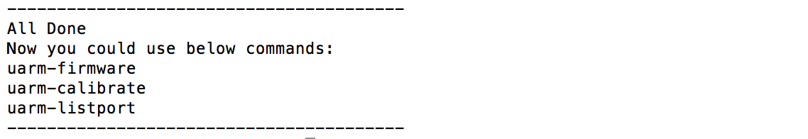

# uArm tools installation

## Windows

This guide would help you install all the environment uArm Tools need in windows.

### Requirement

- Windows 7 or above
- Administrator privilege

### Online installation script
- Open Powershell
- Please input the command to change the Powershell executionpolicy `Set-ExecutionPolicy unrestricted`, Press "Y" to approve
- input this online script `iex ((New-Object System.Net.WebClient).DownloadString('http://download.ufactory.cc/tools/windows/install.ps1'))`

if your network quality doesn't well, it supports proxy.
please run this command before you execute the online script: `$env:chocolateyProxyLocation = 'http://address:port'`

what is the script actually did?
- chocolatey, Software Management. Automated. [https://chocolatey.org/][db374d94]
- Python2, (installed by chocolatey), uArm tools is based on python environment
- pip, (installed by chocolatey), this python tool will help us to download uArm tools.
- pyuarm, uArm python library include all python environment

  [db374d94]: https://chocolatey.org/ "https://chocolatey.org/"

### Tools usage

Now you could use below command in terminal

- `uarm-firmware` - upgrade your uArm firmware  
- `uarm-listport` - show all connected uArm  
- `uarm-calibrate` - calibrate uArm

## MacOS

##### Step 1 - Open `terminal.app`  
 

Search `terminal.app` via Spotlight Search

##### Step 2 - Enter Command to Start Installation

**Step 2.1 Copy & paste the command below to install uArm Enviroment:**

`
    bash -c "$(curl -fsSL http://download.ufactory.cc/tools/macosx/install.sh)"
`

**Notice:**  
If you are installing for the first time, you may be asked to install **Xcode**. Please follow the instruction to install.

  
 

 
 
 
**Step 2.2 When the installation is finished, you will see the words below:**

 
**Step 2.3 After installation, you could use commands below:**    
- `uarm-firmware` - upgrade your uArm firmware  
- `uarm-listport` - show all connected uArm  
- `uarm-calibrate` - calibrate uArm
 

